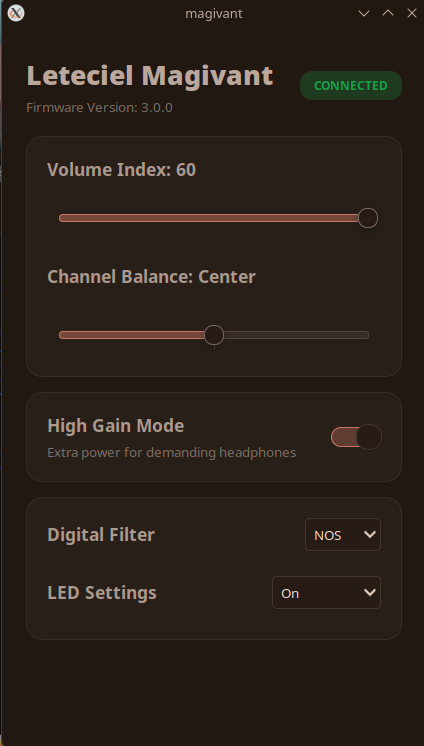

# 🎧 Leteciel Magivant App In Linux


**Magivant-Linux** is a professional, open-source hardware controller for **Leteciel Magivant USB DAC** devices. Built specifically for Linux desktop environments (CachyOS, Arch, Fedora, etc.), it serves as a lightweight and high-performance replacement for the official mobile app, bringing low-level hardware control to your desktop with a native, adaptive interface.

---

## How It Works

**Magivant-Linux** establishes a direct communication channel with the DAC's onboard **microcontroller (MCU)** using low-level USB control transfers. Instead of applying software-based effects, it sends raw commands to modify the hardware registers directly. This allows for precise management of the device's native features—such as volume, gain, and digital filters—without altering or interfering with the digital audio stream."

### Technical Workflow:

1.  **Dynamic Hardware Discovery:** The app utilizes a combination of `popen("lsusb")` for initial identification and `libusb-1.0` for deep descriptor analysis. It dynamically tracks **Vendor ID (VID)** and **Product ID (PID)** to support various hardware revisions.
2.  **Adaptive Permission Engine:** Linux restricts raw USB access to root by default. This app implements a non-intrusive **Polkit (pkexec)** bridge. On the first run, it triggers a native OS password prompt to write a permanent `uaccess` udev rule, granting your user account hardware access without ever needing `sudo` again.
3.  **USB HID & Control Pipe:** Communication is handled via **Synchronous Control Transfers**. Every UI action (like toggling Gain) is translated into a specific 7-byte Hexadecimal payload (e.g., `0xC1 0xA7 ...`) and dispatched via `libusb_control_transfer`.
4.  **Main-Thread Decoupling:** Hardware polling and USB I/O are handled on separate logic cycles, while the UI is updated reactively via `g_idle_add` to ensure the GTK main loop remains buttery smooth and responsive.

---

## Features

* **Precise Hardware Volume:** Direct attenuation control (Index 0-60) synchronized with the internal DAC registers.
* **Channel Balance:** Fine-tune stereo imaging with a high-precision L/R offset.
* **Gain Topology Control:** Toggle between **High Gain** (high-voltage rail for cans) and **Low Gain** (clean floor for sensitive IEMs).
* **Hardware Digital Filters:** Switch between 5 built-in reconstruction algorithms:
    * *Fast Roll-off, Low Latency (Fast LL)*
    * *Fast Roll-off, Phase-compensated (Fast PC)*
    * *Slow Roll-off, Low Latency (Slow LL)*
    * *Slow Roll-off, Phase-compensated (Slow PC)*
    * *Non over-sampling (NOS)*
* **Non-Volatile LED Config:** Set the LED state (On, Off, or Save to hardware memory).
* **Adaptive System Theming:** The interface automatically inherits colors and styling from your **GTK System Theme**, ensuring a consistent look across GNOME, KDE (X11), or Sway/Hyprland.

---
## How To Install
**Clone the repository in your terminal:**

**Run In Terminal**
```bash
./install.sh
```
---

## Screenshots

<div align="center">
  
  &nbsp;
</div>

---

## How To Build

Follow these steps to compile **Magivant-Linux** on your system.

### 1. Prerequisites
Ensure you have the necessary development headers.

**For Arch Linux / CachyOS:**
```bash
sudo pacman -S base-devel gtk3 libusb pkgconf
```
**For Fedora:**
```bash
sudo dnf install gcc gtk3-devel libusb1-devel pkgconf-pkg-config
```
### 2. Manual Build
**Clone the repository and run the compilation in your terminal:**
```bash
git clone https://github.com/RapliVx/Magivant-Dac-App.git
cd Magivant-Dac-App

gcc main.c magivant.c usbdac_manager.c -o magivant $(pkg-config --cflags --libs gtk+-3.0 libusb-1.0) -lpthread

./magivant
```

